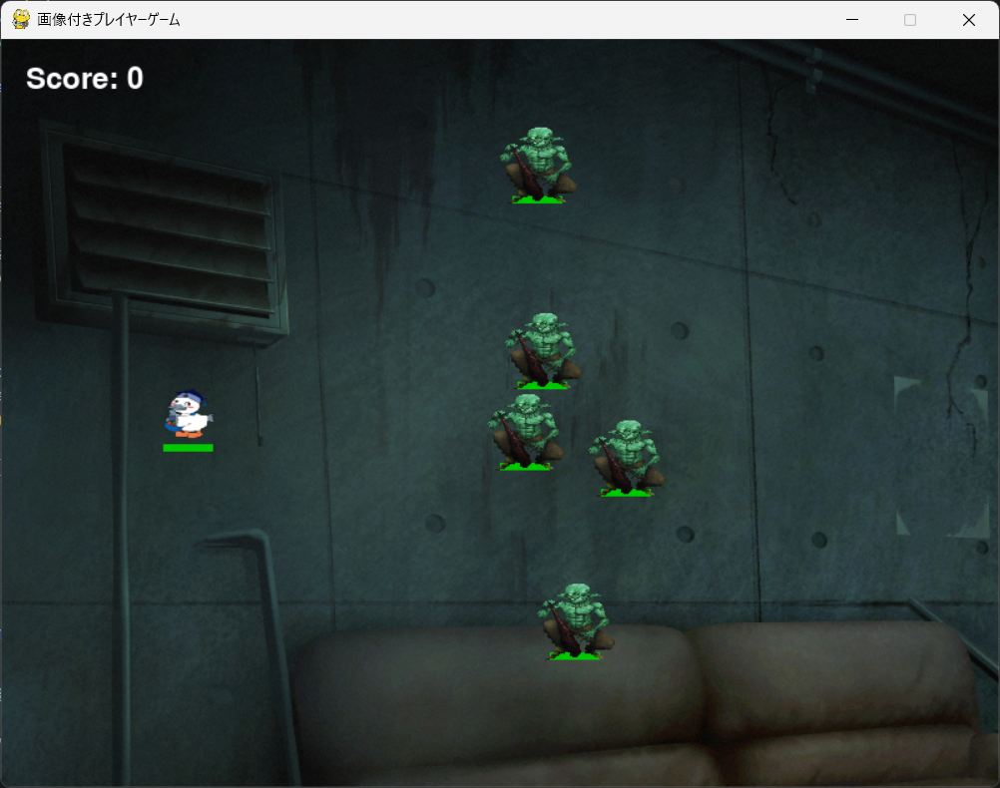

# Kokaton-Strike

## 実行環境の必要条件
* python >= 3.10
* pygame >= 2.1

## ゲームの概要
* こうかとんを引っ張って敵を倒す
* 敵を倒すとスコアがたまる
* 5点貯まったら必殺技を打てる
* 状況に応じて背景が変化する

## ゲームの遊び方
* マウスカーソルでこうかとんを引っ張る
* こうかとんをたくさんの敵に当てる
* こうかとんのHPが0になったら，ゲームオーバーとなる

## ゲームの実装
### 共通基本機能
* 主人公の描画、動き、敵の動き

### 分担追加機能
* プレイヤーと敵にHPを実装し、プレイヤーが一定回数行動するごとに敵が攻撃するターン制要素を追加。　#小野。
* 必殺技の演出全般の追加 #高居
* 敵の特殊機能追加 #小林
* BGM,効果音の追加 #牧野
* スタート、ゲームオーバー画面、背景追加 #神喰

###ゲーム画面
* 

### ToDo
- [ ] 基礎となるシステムの決定
- [ ] 分担追加機能の決定
- [ ] READMEの作成

### メモ
* クラス内の変数は，すべて，「get_変数名」という名前のメソッドを介してアクセスするように設計してある
* すべてのクラスに関係する関数は，クラスの外で定義してある
